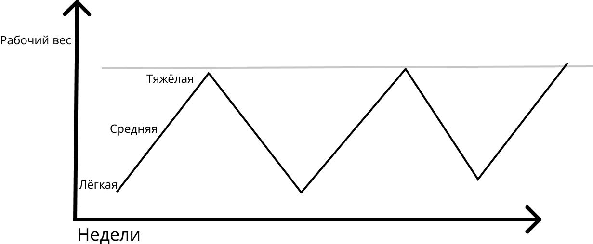
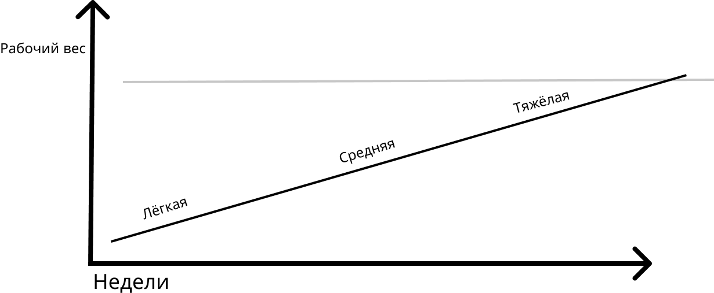

### Что такое циклирование и периодизация? Микроцикл и микропериодизация это синонимы?
 Забегая наперёд скажу, что циклирование и периодизация ***не синонимы***. Циклирование это больше ***что***, а периодизация это больше ***как***.

**Тренировочный цикл** - это некий повторяемый, с изменениями в последующем, распланированный период. 
Существует три классификации циклов:

- Микроцикл - одна тренировка/тренировочная неделя 
- Мезоцкил - от двух до четырёх тренировочных недель 
- Макроцикл - от пяти и более тренировочных недель

<u>Макроцикл</u> состоит из <u>мезоциклов</u>, которые, в свою очередь, состоят из <u>микроциклов</u>. 
Микроцикл направлен на развитие одного из тренируемых качеств. 
Ниже я приведу определения этих качеств приводя альтернативные, более привычные, термины по шкале интенсивности:
 
1. `восстановление (лёгкая тренировка)`
2. `объёмно-силовая (средняя тренировка)` 
3. `выход на пик (тяжёлая тренировка)` 

Макроцикл может быть целиком направлен 
на тренировку одного качества без сменяемости микро и мезоциклов внутри себя, так же, как и может состоять из различных по развиваемым качествам микро и мезоциклов. О том, каким именно образом они меняются, я опишу далее. За это отвечает периодизация.

**Периодизация** - это то с какой частотой тренировочный период сменяется. 

Если мы делаем микроцикл `лёгкий`, а после него микроцикл `тяжёлый`, то это частая смена периода, 
иными словами - **микропериодизация**. 
Тренировки с данным методом  могут выглядеть подобным образом:
1. лёгкая неделя (50% PM* 5х5)
2. средняя неделя (70% РМ* 5х5)
3. тяжёлая неделя (80% РМ* 5х5)
4. лёгкая неделя (55% PM* 5х5)
5. средняя неделя (75% РМ* 5х5)
6. тяжёлая неделя (85% РМ* 5х5)
###### *от разового максимума

Если сменяемость циклов с `легкого` на `средний` и `тяжелый` происходит раз в несколько недель или, даже, месяцев, то такая сменяемость будет называться **макропериодизация**.
Тренировки с данным методом  могут выглядеть подобным образом:
1. лёгкая неделя (50% РМ 5х5)
2. лёгкая неделя (55% РМ 5х5)
3. лёгкая неделя (60% РМ 5х5)
4. средняя неделя (65% РМ 5х5)
5. средняя неделя (70% РМ 5х5)
6. средняя неделя (75% РМ 5х5)
7. тяжёлая неделя (80% РМ 5х5)
8. тяжёлая неделя (85% РМ 5х5)
9. тяжёлая неделя (90% РМ 5х5)

Итого, мы можем наблюдать, что каждая пронумированная неделя это микроцикл, из которых состоит мезо или макроцикл. Неважно какой вид периодизации выбран, ***циклы всегда будут в вашем тренировочном процессе***. Но вот как они меняются: динамично микроциклами, как в первом примере или же более редко, мезоциклами, как во втором примере, за это уже отвечает выбранный вами метод ***периодизации***. 

### А что насчёт линейной и волновой прогрессии?
В поисках ответов на вопросы о циклировании и периодизации, рядовой атлет сталкивается с терминами *линейной* и *волновой* прогрессии.
Что это такое и как они друг от друга отличаются разберём далее.       

**Линейная прогрессия** - это строгий вертикальный путь вверх с планомерным повышением весов. К примеру, 9-ти недельный макроцикл с методом *макропериодизации* выше. Он может быть растянут на больший срок, встраиванием дополнительных тренировок, по такому же типу, соответствующим периоду.

**Волновая прогрессия** - это принцип "шаг назад, два вперёд". К примеру, 6-ти недельный макроцикл с методом *микропериодизации* выше. Но периоды с таким методом прогрессии могут менятся более плавно, так же, и с помощью *макропериодизации*, но с аналогичным, планомерным и волновым прогрессированием веса. Например:
1. лёгкая неделя (50% РМ 5х5)
2. лёгкая неделя (50% РМ 5х5)
3. средняя неделя (65% РМ 5х5)
4. средняя неделя (65% РМ 5х5)
5. тяжёлая неделя (80% РМ 5х5)
6. тяжёлая неделя (80% РМ 5х5)
7. лёгкая неделя (55% РМ 5х5)
8. лёгкая неделя (55% РМ 5х5)
9. средняя неделя (70% РМ 5х5)
10. средняя неделя (70% РМ 5х5)
11. тяжёлая неделя (85% РМ 5х5)
12. тяжёлая неделя (85% РМ 5х5)

---
**Совет по использованию:**

>*От себя могу посоветовать использовать макроциклы с линейной прогрессией атлетам низкого и среднего уровня тренированности, которые впервые столкнулись с застоем(плато). Атлетам выше среднего уровня тренированности - использовать макроциклы с методом волновой прогрессией.*

---

